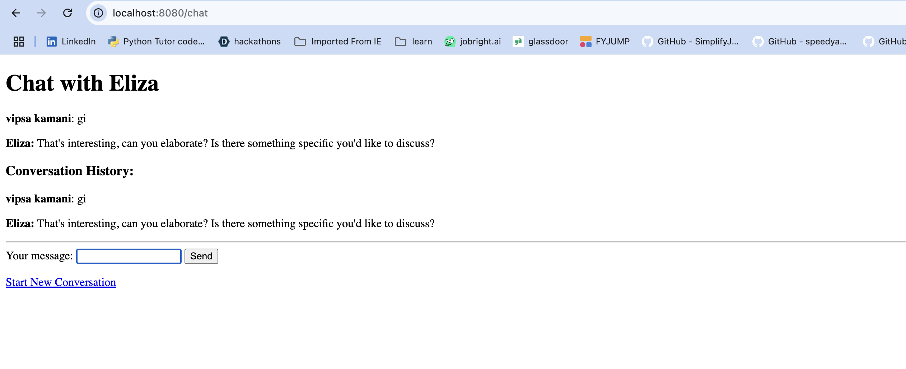

# Eliza Server-Side Chat Application

A Spring Boot implementation of the classic Eliza chatbot using only server-side technologies.

## How to Run

1. **Prerequisites:** Java 11+ and Maven
2. **Start Application:**
   ```bash
   mvn spring-boot:run
   ```
3. **Access:** Open browser to `http://localhost:8080`
4. **Usage:** Enter your name, then chat with Eliza

## Project Structure

```
src/
├── main/
│   ├── java/com/example/eliza/
│   │   ├── ElizaApplication.java          # Main Spring Boot app
│   │   ├── controller/
│   │   │   └── ElizaController.java       # Web endpoints
│   │   ├── service/
│   │   │   └── ElizaService.java          # Chat logic & JSON loading
│   │   └── model/
│   │       ├── ElizaData.java             # JSON data wrapper
│   │       ├── ElizaEntry.java            # Individual chat entries
│   │       ├── SessionData.java           # User session tracking
│   │       └── ConversationTurn.java      # Chat history
│   └── resources/
│       ├── eliza.json                     # Chat responses data
│       └── templates/
│           ├── index.html                 # Name input page
│           └── chat.html                  # Chat interface
└── pom.xml                                # Maven dependencies
```

## Features

- ✅ No client-side JavaScript
- ✅ Session-based conversation tracking
- ✅ Randomized responses without repetition
- ✅ Keyword matching from JSON file
- ✅ Full conversation history display

# output chat Screenshot


